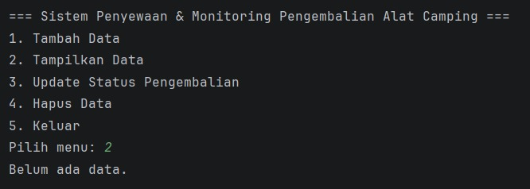
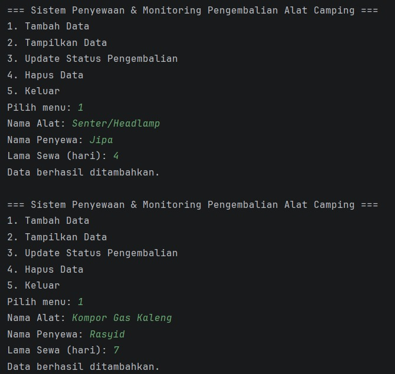
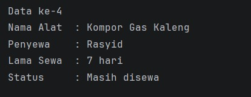
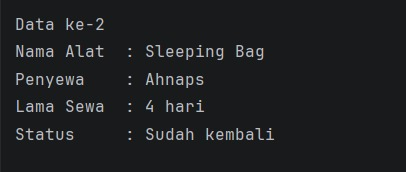

<h1>Sistem Penyewaan & Monitoring Pengembalian Alat Camping</h1>

<h2>Nama :Rusdiansyah</h2>
<h2>NIM :2409106013</h2>
<h2>Kelas :A1'24</h2>

<h2>A.Deskripsi Program</h2>
Program ini adalah aplikasi berbasis Java yang dirancang untuk mengelola data penyewaan alat camping secara digital. Pengembangan program ini menerapkan konsep Pemrograman Berorientasi Objek (OOP) dengan memanfaatkan ArrayList sebagai media penyimpanan data dinamis selama program berjalan.

<h2>B.Fitur Utama</h2>
Sistem ini menyediakan fungsi manajemen data dasar (CRUD) yang meliputi:

1. Tambah Data (Create): Menginput data penyewaan baru.
2. Tampilkan Data (Read): Melihat daftar seluruh alat yang sedang disewa.
3. Update Status (Update): Mengubah status pengembalian alat secara spesifik.
4. Hapus Data (Delete): Menghapus catatan penyewaan dari sistem.

Program dilengkapi dengan menu interaktif yang akan terus berjalan (looping) hingga pengguna memilih untuk keluar.

<h2>C.Struktur Class</h2>
1. AlatCamping: Berperan sebagai model data yang menyimpan atribut seperti nama alat, nama penyewa, durasi sewa, dan status pengembalian.
2. Main: Sebagai class utama yang menangani alur logika program, input dari pengguna, dan manajemen menu sistem.

<h2>Berikut adalah alur jalannya program Sistem Penyewaan & Monitoring Alat Camping:</h2>

1. Tampilan Menu Utama dan Validasi Data Kosong
   Pada saat program pertama kali dijalankan, sistem akan menampilkan menu utama dengan 5 pilihan. Jika pengguna memilih Menu 2 (Tampilkan Data) sebelum ada data yang diinput, program akan memberikan pesan validasi "Belum ada data". Hal ini menunjukkan bahwa ArrayList masih dalam keadaan kosong.
   

2. Proses Tambah Data (Create)
   Pengguna dapat menambahkan data penyewaan melalui Menu 1. Sistem akan meminta input berupa:

- Nama Alat: Contoh: Tenda, Sleeping Bag, Senter, Kompor.
- Nama Penyewa: Nama orang yang menyewa alat.
- Lama Sewa: Durasi sewa dalam hitungan hari.
  Setiap data yang berhasil diinput akan memicu pesan konfirmasi "Data berhasil ditambahkan", yang berarti objek baru telah berhasil disimpan ke dalam list.
  
  

3. Menampilkan Daftar Penyewaan (Read)
   Setelah beberapa data dimasukkan, pengguna bisa melihat seluruh daftar melalui Menu 2. Program akan melakukan perulangan untuk menampilkan detail setiap penyewaan, mulai dari "Data ke-1" hingga seterusnya. Secara default, status setiap alat yang baru diinput adalah "Masih disewa"
   
   

4. Update Status Pengembalian (Update)
   Melalui Menu 3, pengguna dapat memperbarui status alat yang sudah dikembalikan. Pengguna cukup memasukkan nomor urut data (misalnya nomor 2). Setelah diproses, status pada data tersebut akan berubah dari "Masih disewa" menjadi "Sudah kembali". Ini memudahkan pengelola untuk memantau alat mana saja yang belum kembali.
   
   

5. Penghapusan Data (Delete)
   Jika ada data yang salah atau sudah tidak diperlukan, pengguna bisa menggunakan Menu 4. Setelah memasukkan nomor data yang ingin dihapus (misalnya nomor 2), sistem akan menghapus objek tersebut dari list dan memberikan konfirmasi "Data berhasil dihapus". Saat daftar ditampilkan kembali, nomor urut data akan otomatis menyesuaikan dengan jumlah data yang tersisa.
   
   

6. Keluar dari Sistem
   Untuk mengakhiri sesi, pengguna dapat memilih Menu 5. Program akan menampilkan pesan "Program selesai".
   
