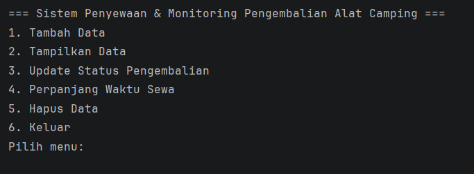
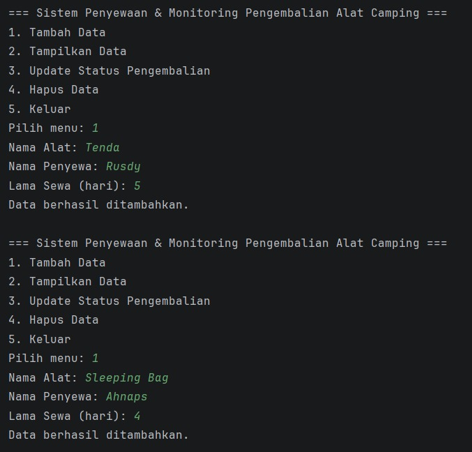
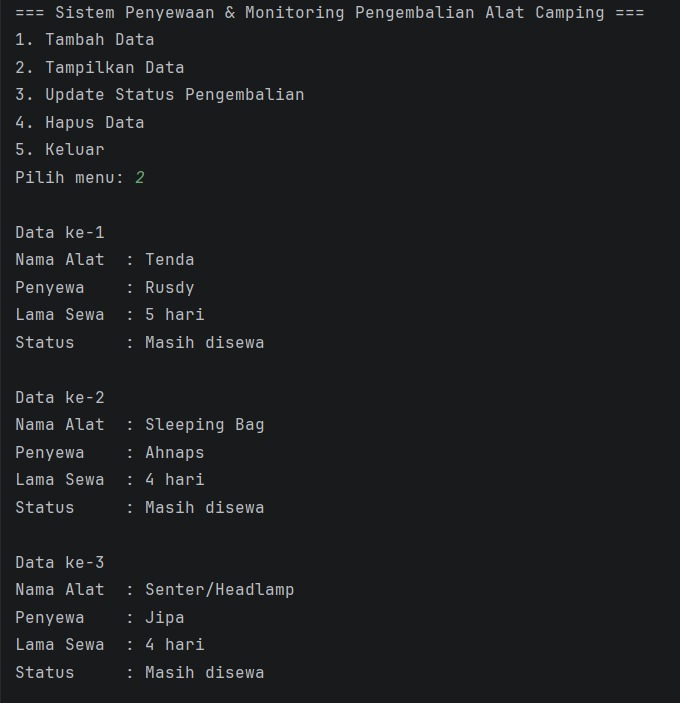
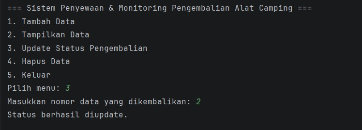
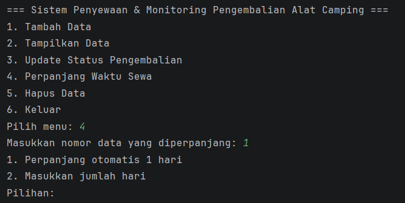
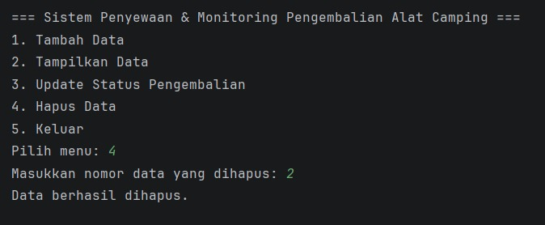
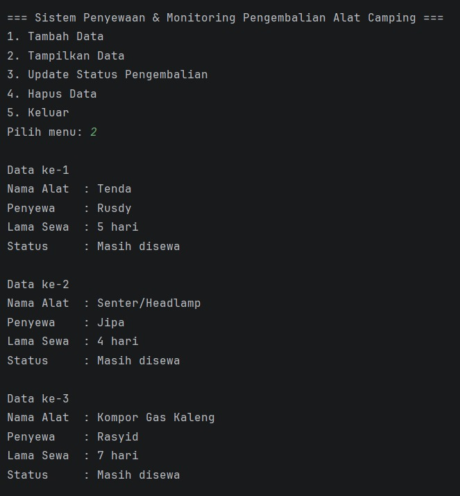
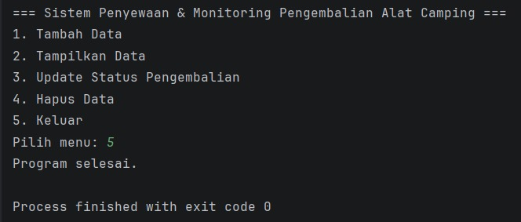

<h1>Sistem Penyewaan & Monitoring Pengembalian Alat Camping</h1>

<h2>Nama : Rusdiansyah</h2>
<h2>NIM : 2409106013</h2>
<h2>Kelas : A1'24</h2>

<h2>A. Deskripsi Program</h2>
Program ini adalah aplikasi berbasis Java yang dirancang untuk mengelola data penyewaan alat camping secara digital. Pengembangan program ini menerapkan konsep Pemrograman Berorientasi Objek (OOP), khususnya materi <b>Inheritance</b> dan <b>Polymorphism (Overloading & Overriding)</b>, dengan memanfaatkan ArrayList sebagai media penyimpanan data dinamis selama program berjalan.

<h2>B. Fitur Utama</h2>
Sistem ini menyediakan fungsi manajemen data yang meliputi:

1. Tambah Data (Create): Menginput data penyewaan baru berdasarkan spesifikasi alat.
2. Tampilkan Data (Read): Melihat daftar seluruh alat yang sedang disewa beserta spesifikasi dan cara perawatannya.
3. Update Status Pengembalian (Update): Mengubah status alat (sudah kembali/masih disewa).
4. Perpanjang Waktu Sewa (Update): Menambah durasi hari penyewaan alat.
5. Hapus Data (Delete): Menghapus catatan penyewaan dari sistem.

Program dilengkapi dengan menu interaktif yang akan terus berjalan (looping) hingga pengguna memilih untuk keluar.

<h2>C. Struktur Class</h2>
1. AlatCamping (Superclass): Berperan sebagai model data utama yang menyimpan atribut umum seperti nama alat, nama penyewa, durasi sewa, dan status pengembalian, serta memuat fungsi polimorfisme statis (Overloading).
2. Tenda, Carrier, SleepingBag (Subclass): Class turunan yang memiliki atribut spesifik masing-masing dan menerapkan polimorfisme dinamis (Overriding) untuk menampilkan spesifikasi dan instruksi perawatan yang berbeda-beda.
3. Main: Sebagai class utama yang menangani alur logika program, input dari pengguna, dan manajemen menu sistem.

<h2>D. Alur Jalannya Program:</h2>

1. Tampilan Menu Utama dan Validasi Data Kosong
   Pada saat program pertama kali dijalankan, sistem akan menampilkan menu utama dengan 6 pilihan. Jika pengguna memilih Menu 2 (Tampilkan Data) sebelum ada data yang diinput, program akan memberikan pesan validasi "Belum ada data". Hal ini menunjukkan bahwa ArrayList masih dalam keadaan kosong.
   

2. Proses Tambah Data (Create)
   Pengguna dapat menambahkan data penyewaan melalui Menu 1. Sistem akan meminta pengguna memilih jenis alat terlebih dahulu (Tenda/Carrier/Sleeping Bag), kemudian meminta input berupa:
   - Nama Alat: (Merk/Seri)
   - Nama Penyewa: Nama orang yang menyewa alat.
   - Lama Sewa: Durasi sewa dalam hitungan hari.
   - Atribut Spesifik: Kapasitas orang (Tenda), Liter (Carrier), atau Bahan (Sleeping Bag).
     Setiap data yang berhasil diinput akan memicu pesan konfirmasi "Data berhasil ditambahkan".
     

3. Menampilkan Daftar Penyewaan (Read)
   Setelah data dimasukkan, pengguna bisa melihat daftar melalui Menu 2. Program akan menampilkan detail penyewaan beserta spesifikasi khusus dan panduan cara perawatan alat yang di-generate menggunakan metode Overriding.
   

4. Update Status Pengembalian (Update)
   Melalui Menu 3, pengguna dapat memperbarui status alat. Pengguna memasukkan nomor data, lalu sistem memberikan 2 opsi menggunakan metode Overloading:
   - Update otomatis: Status langsung di-set "Sudah kembali" tanpa perlu input nilai.
   - Update manual: Pengguna mengetikkan "true" atau "false".
     

5. Perpanjang Waktu Sewa (Fitur Baru)
   Melalui Menu 4, pengguna dapat menambah durasi sewa alat yang sedang berjalan. Sistem menggunakan metode Overloading untuk memberikan 2 pilihan:
   - Perpanjang otomatis: Waktu sewa otomatis ditambah 1 hari (menggunakan fungsi tanpa parameter).
   - Input manual: Pengguna memasukkan jumlah hari tambahan sesuai keinginan (menggunakan fungsi dengan parameter integer).
     

6. Penghapusan Data (Delete)
   Jika ada data yang salah atau sudah tidak diperlukan, pengguna bisa menggunakan Menu 5. Setelah memasukkan nomor data, sistem akan menghapus objek tersebut dari list dan memberikan konfirmasi "Data berhasil dihapus".
   
   

7. Keluar dari Sistem
   Untuk mengakhiri sesi, pengguna dapat memilih Menu 6. Program akan menampilkan pesan "Program selesai".
   